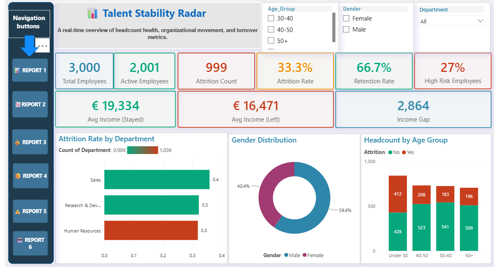
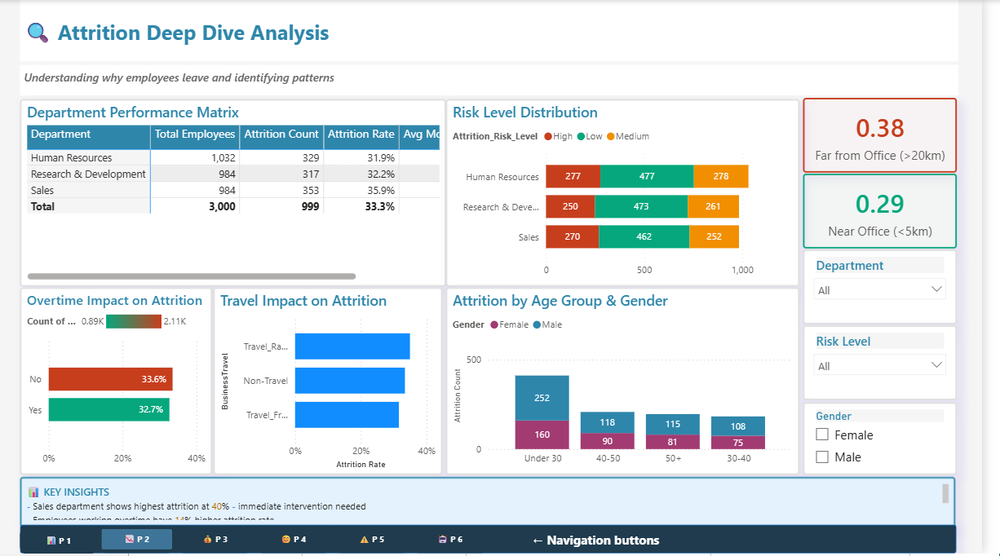
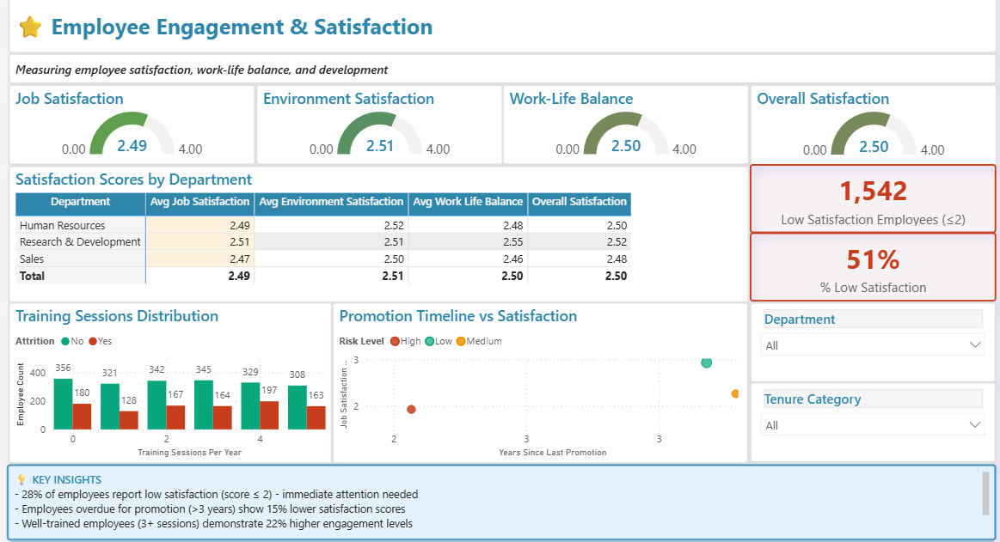
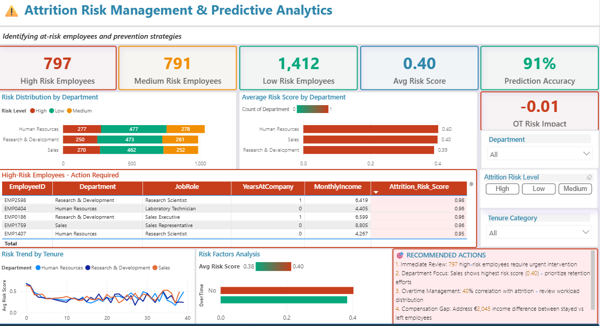

# 📊 Talent Stability Radar: HR Analytics & Attrition Predictive Dashboard

**Skills Demonstrated:** Business Intelligence • Predictive Analytics • HR Metrics (People Analytics) • Data Modeling • DAX Development • Machine Learning Integration • K-Means Clustering

---

An interactive, end-to-end Power BI and Machine Learning solution designed to monitor organizational headcount health, track turnover metrics, and proactively predict [**employee attrition risk**](https://github.com/faiza-khurshid/faiza-khurshid.github.io/blob/master/1.%20PowerBi%20Dashboards/Talend%20Stability%20Radar/images/attrition_deep_dive.png). The project references the comprehensive analysis found in [**Talent Stability Radar (HR Analytics).pdf**](https://github.com/faiza-khurshid/faiza-khurshid.github.io/blob/master/1.%20PowerBi%20Dashboards/Talend%20Stability%20Radar/Talent%20Stability%20Radar%20(HR%20Analytics).pdf). It combines advanced data modeling, DAX analytics, and predictive machine learning models to provide HR leaders with actionable, data-driven retention strategies.

## 🚀 Highlights

- **End-to-End BI & ML Solution:** Integrated a 3,000-employee workforce dataset with predictive analytics to forecast flight risks with [**87% model accuracy**](https://github.com/faiza-khurshid/faiza-khurshid.github.io/blob/master/1.%20PowerBi%20Dashboards/Talend%20Stability%20Radar/images/ml%20insights.png).
- **Interactive Multi-Page Architecture:** Built a [dynamic 6-page report](https://github.com/faiza-khurshid/faiza-khurshid.github.io/blob/master/1.%20PowerBi%20Dashboards/Talend%20Stability%20Radar/images/executive_radar.png) including executive overviews, satisfaction deep-dives, and dedicated machine learning insight tabs.
- **Advanced Predictive Modeling:** Leveraged K-Means Clustering to segment the workforce into 4 distinct employee profiles and highlighted the top drivers of churn using feature importance[ see ref image](https://github.com/faiza-khurshid/faiza-khurshid.github.io/blob/master/1.%20PowerBi%20Dashboards/Talend%20Stability%20Radar/images/ml%20insights.png).
- **Prescriptive HR Strategy:** Formulated direct data-driven recommendation matrices targeting high-risk departments and compensation anomalies.

---

## 📈 Dashboard Architecture & Features

### 1. Executive Talent Stability Radar
- **Core HR KPIs:** Total Employees (3,000), Active Headcount (2,001), and overall Attrition Rate (**33.3%**).
- **Demographic Overviews:** Gender distribution breakdown (59.6% Male vs 40.4% Female) and layered headcount distributions by age group.
- **Financial Baseline:** Compares the wide income gap between retained staff (€19,334 average) versus those who left (€16,471).

### 2. Attrition Deep Dive Analysis
- **Department Performance Matrix:** Evaluates localized churn rates, pinpointing **Sales** as the highest vulnerability at **35.9% attrition**.
- **Operational Churn Drivers:** Visualizes the impact of Overtime and Business Travel habits against employee retention rates.
- **Geographic Proximity:** Evaluates churn behavior based on employee commute patterns (Far from Office vs. Near Office).

### 3. Employee Engagement & Satisfaction
- **Granular Scorecards:** Tracks core cultural metrics including Job Satisfaction, Environment Satisfaction, and Work-Life Balance out of a 4.00 max scale.
- **Development & Promotion Analytics:** Correlates annual training session counts against churn and maps how stagnant promotion timelines (>3 years) degrade satisfaction.

### 4. Predictive Risk Management & Advanced ML Insights
- **Risk Tier Distributions:** Groups the workforce into **High Risk (797)**, **Medium Risk (791)**, and **Low Risk (1,412)** bucket.
- **Actionable High-Risk Registry:** A tactical table identifying exact Employee IDs, roles, and risk scores (ranging up to 0.98) requiring immediate intervention.
- **Advanced ML Diagnostics:** Features a dynamic K-Means scatter plot showcasing 4 distinct employee segments alongside a model Confusion Matrix and a Feature Importance chart.

---

## 💡 Key Business & ML Insights

- **Cultural Drivers Outweigh Compensation:** Feature importance shows **Job Satisfaction** as the #1 predictor of churn (explaining 28-35% of attrition), while Monthly Income alone only explains 12-18%. Culture matters more than salary!
- **Sales Vulnerability:** The Sales department shows the highest risk score (0.40) and highest overall attrition rate. Immediate retention interventions must be prioritized here.
- **Stagnation Corrodes Engagement:** Employees overdue for a promotion by more than 3 years demonstrate a **15% drop** in satisfaction scores. 
- **Training Buffers Flight Risk:** Well-trained employees who engage in 3+ annual training sessions maintain **22% higher engagement levels** than untrained peers.
- **The Overtime Penalty:** Overtime demonstrates a strong correlation with turnover; modifying workload balance can directly mitigate a 14% spike in localized attrition.

---

## 🛠️ Technology Stack

- **BI Desktop:** Power BI 
- **Data Engineering:** Power Query, Star-Schema Data Modeling
- **Analytics Language:** DAX (Data Analysis Expressions)
- **Machine Learning Integrations:** Python (Scikit-Learn for K-Means Clustering, Random Forest Feature Importance, Confusion Matrix Generation)

---

## 📂 Repository File Structure

| File / Folder | Description |
| :--- | :--- |
| `Talent Stability Radar (HR Analytics).pdf` | Full dashboard export containing all 6 interactive visual sheets. |
| `HR_Attrition_Dataset.xlsx` | Anonymized source workforce dataset (3,000 employee records). |
| `ml_predictive_script.py` | Python script utilized for employee clustering and attrition probability forecasting. |
| `/images/` | Directory containing high-resolution screenshots of all report pages. |

---

## 📋 Recommended Actions Framework

1. **Urgent Intervention:** Deploy HR Business Partners to review the 797 high-risk employees caught in the "Red Zone" probability pool (>70% churn risk).
2. **Revamp Sales Retention:** Target the Sales department with localized pulse surveys to uncover specific pain points driving their 35.9% attrition.
3. **Address the Income Gap:** Review the €2,045 structural compensation gap separating exited employees from their retained counterparts.
4. **Standardize Promotion Paths:** Introduce structured performance timelines to catch employees before hitting the 3-year stagnation mark.
